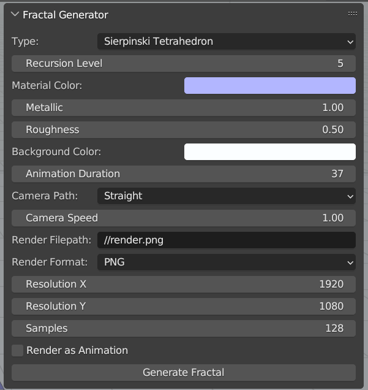
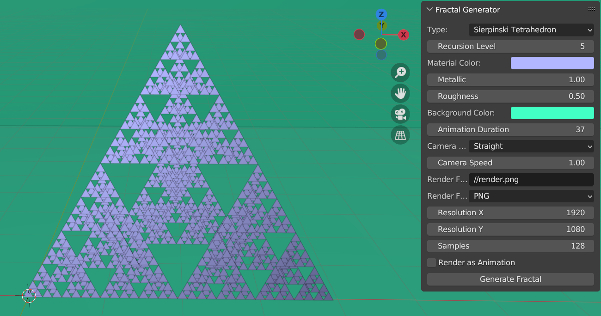

# Fractal Generator Addon for Blender

## Overview
The Fractal Generator addon for Blender, created by Euan Goodbrand, allows users to generate 3D fractal structures such as Sierpinski Tetrahedrons and Menger Sponges. This addon provides a user-friendly interface to customize fractal properties, add animations, and render high-quality images or animations.

## Features
- **Fractal Types**: Generate Sierpinski Tetrahedrons and Menger Sponges.
- **Recursion Level**: Control the level of recursion for fractal generation.
- **Material Customization**: Set material color, metallic property, and roughness for fractals.
- **Background Customization**: Choose the color of the background.
- **Animation**: Add camera animations with options for straight, circular, and spiral paths.
- **Render Settings**: Customize render resolution, format, and samples.
- **Save Render**: Save the render as an image or an animation.

## Installation
1. Download the `fractal_generator.py` file.
2. Open Blender (version 3.6.1).
3. Go to `Edit > Preferences`.
4. In the Preferences window, go to the `Add-ons` tab.
5. Click `Install` and select the downloaded `fractal_generator.py` file.
6. Enable the addon by checking the box next to `Fractal Generator`.

## How to Use
1. In the 3D Viewport, press `N` to open the side panel.
2. Navigate to the `Tools` tab and find the `Fractal Generator` panel.
3. Customize the fractal properties:
   - **Fractal Type**: Choose between "Sierpinski Tetrahedron" and "Menger Sponge".
   - **Recursion Level**: Set the number of recursive steps (1 to 5).
   - **Material Color**: Select the color for the fractal.
   - **Metallic**: Adjust the metallic property of the material.
   - **Roughness**: Adjust the roughness property of the material.
   - **Background Color**: Select the background color.
   - **Animation Duration**: Set the duration of the animation in frames.
   - **Camera Path**: Choose the camera path (Straight, Circle, Spiral).
   - **Camera Speed**: Adjust the speed of the camera along the path.
   - **Render Filepath**: Specify the filepath to save the render.
   - **Render Format**: Choose the format to save the render (PNG, JPEG, TIFF, EXR).
   - **Render Resolution X**: Set the render resolution width.
   - **Render Resolution Y**: Set the render resolution height.
   - **Render Samples**: Set the number of samples for rendering.
   - **Render as Animation**: Check this box to render as an animation.
4. Click the `Generate Fractal` button to create the fractal.

## Example Workflow
1. Open Blender and install the addon.
2. Go to the 3D Viewport and open the Fractal Generator panel in the `Tools` tab.
3. Select "Sierpinski Tetrahedron" as the fractal type.
4. Set the recursion level to 3.
5. Choose a material color, for example, blue.
6. Set the metallic to 0.2 and roughness to 0.5.
7. Select a background color, for example, white.
8. Set the animation duration to 200 frames.
9. Choose "Spiral" as the camera path and set the speed to 1.0.
10. Specify the render filepath, e.g., `//render.png`.
11. Choose PNG as the render format.
12. Set the render resolution to 1920x1080.
13. Set the render samples to 128.
14. Check the `Render as Animation` box.
15. Click `Generate Fractal` to create and render the fractal animation.

## Script Overview
The script contains several functions and classes to facilitate fractal generation and rendering:

### Script Functions
- `rotate_object(obj, angle, axis)`: Rotates the object around the specified axis.
- `add_camera_and_zoom_animation(location, end_frame, camera_path='STRAIGHT', speed=1.0)`: Adds a camera and creates a zoom animation.
- `add_floor_and_backdrop(size, background_color)`: Adds a floor and backdrop with the specified background color.
- `add_lighting()`: Adds lighting to the scene.
- `sierpinski_3d(base_triangle, location, size, iterations, current_depth=0, max_depth=0)`: Generates a 3D Sierpinski Tetrahedron.
- `assign_material_to_fractal(color, metallic, roughness)`: Assigns material properties to the fractal.
- `save_render(filepath, format, is_animation)`: Saves the render as an image or animation.
- `apply_gradient_color(obj, depth, max_depth)`: Applies gradient color to the fractal based on depth.

### Classes
- `MengerSponge`: Class to generate a Menger Sponge fractal.
- `FractalProperties`: Property group for storing fractal properties.
- `OBJECT_OT_generate_fractal`: Operator for generating the fractal.
- `OBJECT_PT_fractal_panel`: UI panel for the Fractal Generator addon.

## Changelog
### Version 1.5
- Added spiral camera path option.
- Added support for TIFF and EXR render formats.
- Added gradient color application based on recursion depth.

## License
This addon is licensed under the MIT License.

## Completed Features
- [x] Generate 3D fractals (Sierpinski Tetrahedron, Menger Sponge)
- [x] Customizable recursion levels
- [x] Material customization (color, metallic, roughness)
- [x] Background color customization
- [x] Camera animations (straight, circular, spiral)
- [x] Render settings customization (resolution, format, samples)
- [x] Save renders as images or animations
- [x] Gradient color based on recursion depth

## Future Enhancements
- [ ] Add 2D fractals (e.g., Sierpinski Triangle, Koch Snowflake)
- [ ] Improve efficiency for handling higher recursion levels
- [ ] Add more fractal types (e.g., Julia Set, Mandelbrot Set)
- [ ] Implement interactive real-time fractal adjustments
- [ ] Enhance UI with more user-friendly controls and previews

---

Enjoy generating beautiful fractal structures with the Fractal Generator addon for Blender! If you have any questions or need further assistance, feel free to reach out to the author.